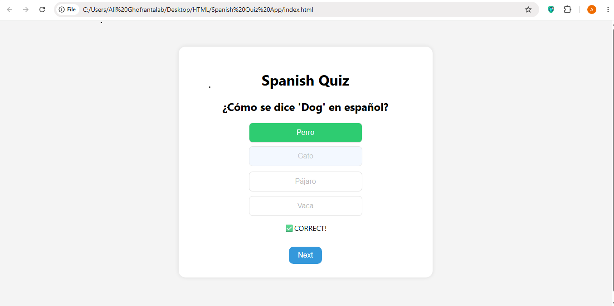
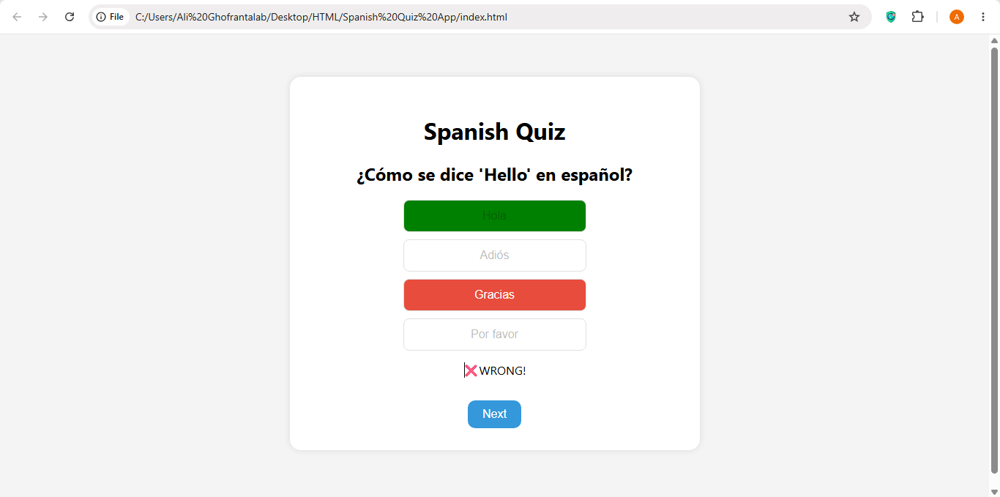

# Spanish Quiz App

A simple and interactive multiple-choice quiz application designed to help users learn basic Spanish vocabulary in a fun and engaging way.

This project was built as a beginner-friendly exercise to strengthen my skills in **HTML, CSS, and JavaScript (Vanilla JavaScript)**.

---

## 🚀 Live Demo

## https://alighofrantalab.github.io/Spanish-Quiz-APP/

## ✨ Features

🎯 Multiple-choice Spanish vocabulary questions

🧠 Instant feedback for correct and wrong answers

🟢 Correct answer highlighted in green

🔴 Wrong answer highlighted in red

➡️ Next question navigation system

🔁 Quiz restart after finishing all questions

🎨 Clean and user-friendly interface

---

## 📸 Preview

### 🟢 Correct Answer



### 🔴 Wrong Answer



---

## 🛠️ Built With

- HTML5
- CSS3
- Vanilla JavaScript (ES6)

---

## 📚 What I Learned

- Working with arrays and objects in JavaScript
- DOM manipulation
- Event handling (click events)
- Managing application state using variables
- Conditional logic and answer validation
- Dynamic UI updates based on user interaction
- Building a complete mini-project from scratch

---

## 📂 Project Structure

```text
Spanish-Quiz-App/
│
├── index.html
├── style.css
├── script.js
├── README.md
│
└── images/
    ├── correct-answer.png
    └── wrong-answer.png
```

---

## 🧭 Version History

**v1.0** → Initial release (basic multiple-choice quiz application)

**v1.1** → Planned UI improvements and bug fixes

**v2.0** → Planned score system, timer, and progress tracking

---

## 📌 Future Improvements

- 📊 Add score tracking system
- ⏱️ Add timer for each question
- 📈 Add progress bar
- 💾 Save scores with Local Storage
- 🌙 Add Dark Mode
- 📱 Improve mobile responsiveness
- 🎨 Add animations and transitions
- 🏆 Show final score summary

---

## 👨‍💻 Author

**Ali Ghofrantalab**

GitHub: https://github.com/AliGhofrantalab

Project created for learning and portfolio purposes.

---

## ⚠️ Note

This is a beginner-level project created to practice JavaScript fundamentals and build a strong front-end development portfolio.
